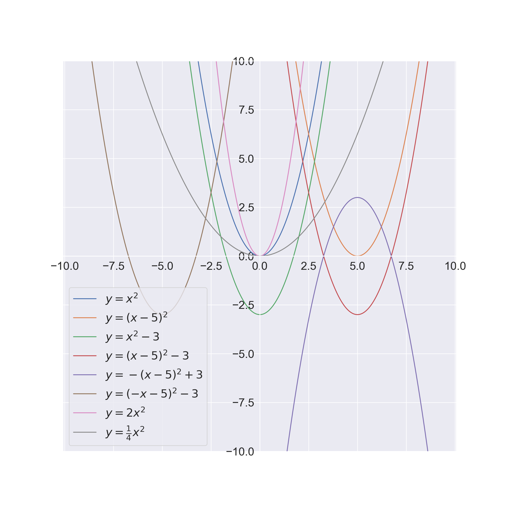

Functions
=========

Changing Functions
------------------

You can move functions very easily:

* :math:`f(x - a)` is :math:`f(x)` moved horizontally :math:`a` units

.. warning:: :math:`f(x - 3)` is :math:`f(x)` moved :math:`3` units to the **right**

* :math:`f(x) + q` is :math:`f(x)` moved vertically :math:`q` units

This is how to mirror them:

* :math:`-f(x)` is :math:`f(x)` mirrored on the x-axis

* :math:`f(-x)` is :math:`f(x)` mirrored on the y-axis

You can of course stretch/compress functions too:

* :math:`a \cdot f(x)` is :math:`f(x)` stretched by the factor :math:`a`

* :math:`\frac{1}{a} \cdot f(x)` is :math:`f(x)` compressed by the factor :math:`a`

