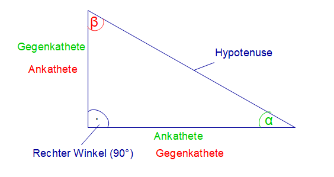
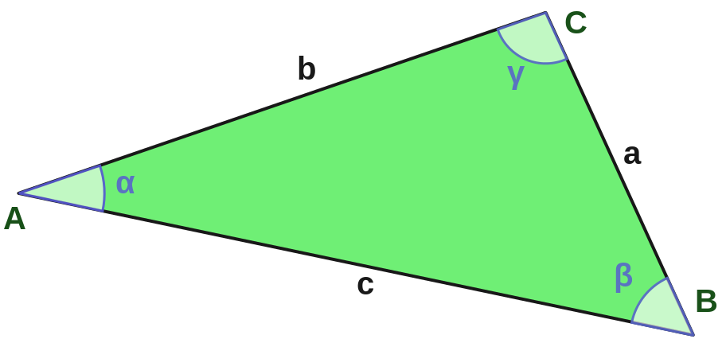
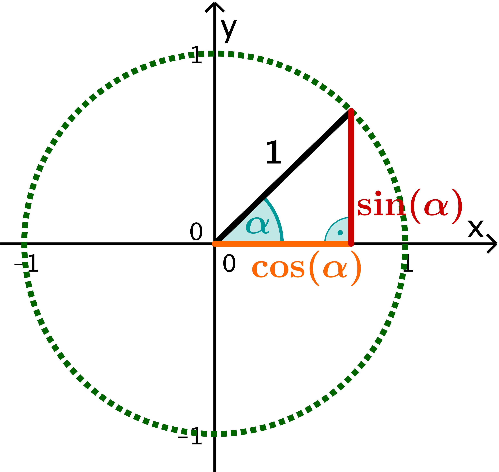

Trigonometrie
=============

Im rechtwinkligen Dreieck
-------------------------

[#]_

:math:`\displaystyle \sin(\alpha) = \frac{Gegenkathete}{Hypotenuse}`

:math:`\displaystyle \cos(\alpha) = \frac{Ankathete}{Hypotenuse}`

:math:`\displaystyle \tan(\alpha) = \frac{Gegenkathete}{Ankathete}`

Allgemeines Dreieck
-------------------

[#]_

Sinussatz:
    :math:`\displaystyle \frac{a}{\sin(\alpha)} = \frac{b}{\sin(\beta)} = \frac{c}{\sin(\gamma)} = 2r`

    mit Umkreisradius :math:`r`

Kossinusinussatz:
    :math:`a^2 = b^2 + c^2 -2bc \cdot \cos(\alpha)`

    :math:`b^2 = a^2 + c^2 -2ac \cdot \cos(\beta)`

    :math:`c^2 = a^2 + b^2 -2ab \cdot \cos(\gamma)`

Flächensatz:
    :math:`A = \frac{1}{2}ab \cdot sin(\gamma) = \frac{1}{2}ac \cdot sin(\beta) = \frac{1}{2}bc \cdot sin(\alpha)`

Folgerungen aus dem Einheitskreis
---------------------------------

[#]_

:math:`\sin(\alpha) = \sin(180^\circ - \alpha) = sin(\pi - \alpha)`

:math:`\sin(\alpha) = \sin(\alpha + k \cdot 360^\circ) = sin(\alpha + k \cdot 2\pi)`

:math:`\cos(\alpha) = \cos(360^\circ - \alpha) = cos(2\pi - \alpha)`

:math:`\cos(\alpha) = \cos(\alpha + k \cdot 360^\circ) = cos(\alpha + k \cdot 2\pi)`

:math:`\displaystyle \tan(\alpha) = \frac{\sin(\alpha)}{\cos(\alpha)}`

.. warning::
    Beachte, dass du im TI-84 Plus [#]_ per ``MODE`` Taste in ein Menu kommst,
    in welchem du in der 3. Zeile ``RADIAN`` oder ``DEGREE`` auswählen kannst.
    Diese Einstellungen stehen für Kreismass und Grad und bedeuten, in welchem
    Mass die Trigonometrie :math:`^{-1}` Funktionen Werte ausgeben und in welchem
    Mass die normalen Trigonometrie Funktionen Werte entgegennehmen.

.. [#] https://www.ingenieurkurse.de/technische-mechanik-statik/grundlagen-der-technischen-mechanik/trigonometrie-am-rechtwinkligen-dreieck.html
.. [#] https://de.wikipedia.org/wiki/Dreieck
.. [#] https://de.serlo.org/mathe/geometrie/sinus-kosinus-tangens/sinus-kosinus-tangens-einheitskreis/trigonometrie-einheitskreis
.. [#] https://education.ti.com/en/products/calculators/graphing-calculators/ti-84-plus
