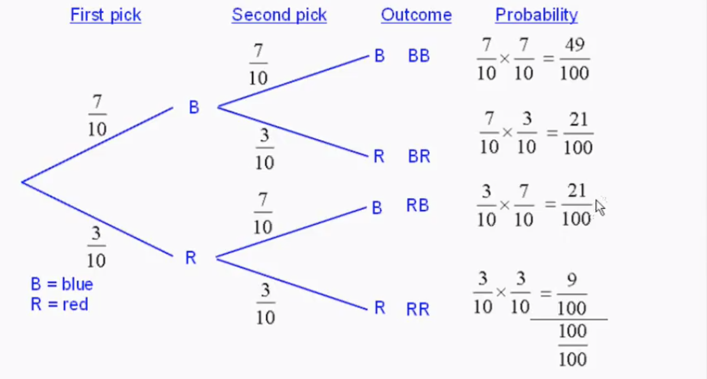
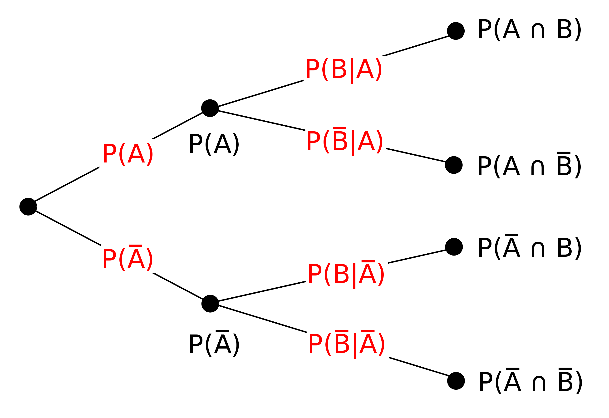

Elementare Wahrscheinlichkeit [#]_
==================================

Axiome von Kolgorow
-------------------

Für jedes Ereignis :math:`A \in \Sigma` und
:math:`B \in \Sigma` gilt:

#. :math:`P(A) \geq 0`

#. :math:`P(\Omega) = 1`

#. :math:`A \cap B = \emptyset \to P(A \cup B) = P(A) + P(B)`

Definitionen
------------

* Potenzmenge :math:`\Sigma` (lies Sigma) ist die Grundmenge bzw. Ergebnisraum

* Ergebnismenge :math:`\Omega` (lies Omega) ist die Menge
  aller Ergebnisse eines Zufallsexperiments

* :math:`\Sigma = \{\emptyset, \Omega\} + \Omega`

Folgerungen aus Kolgorow's Axiomen
----------------------------------

Für jedes Ereignis :math:`A \in \Sigma` und
:math:`B \in \Sigma` gilt:

#. :math:`P(\Omega \setminus A) = 1 - P(A)`

#. :math:`P(\emptyset) = 0`

#. :math:`P(A \cup B) = P(A) + P(B) + P(A \cap B)`

#. :math:`P(A \cup B) = P(A \setminus B) + P(A \cap B) + P(B \setminus B)`

#. :math:`P(A) = P(A \setminus B) + P(A \cap B)`

#. :math:`P(B) = P(B \cap A) + P(B \setminus A)`

#. :math:`P(A) + P(B) = P(A \cup B) + P(A \cap B)`

Laplace-Experiment
------------------

Ein Zufallsexperiment heisst Laplace-Experiment,
wenn alle Elementarereignisse die gleiche Wahrscheinlichkeit besitzen.

:math:`\displaystyle \omega \in \Omega: P(\{\omega\}) = \frac{1}{|\Omega|}`

    :math:`|\Omega|` ist die Mächtigkeit von :math:`\Omega`,
    also die Anzahl Elemente

Beispiele
^^^^^^^^^

**Würfelwurf:** :math:`P(\{2\}) = \frac{1}{6}`

**Münzwurf:** :math:`P(\{Kopf\}) = \frac{1}{2}`

**Roulette:** :math:`P(\{17\}) = \frac{1}{37}`

Mehrstufiges Zufallsexperiment
------------------------------

Wird ein Zufallsexperiment mehrmals durchgeführt oder
werden verschiedene Zufallsexperimente nacheinander
ausgeführt, so kann man dies als einmalige Ausführung
eines **mehrstufigen Zufallsexperiments** auffassen. Wir
stellen ein mehrstufiges Zufallsexperiment mithilfe
eines **Baumdiagramms** dar.

**Beispiel:** In einer Urne liegen 7 blaue und 3 rote
Kugeln. Es werden nacheinander 2 Kugeln mit Zurücklegen
gezogen.

    **1. Experiment:** Ziehung der 1. Kugel mit :math:`\Omega_1 = \{r, b\}`

    **2. Experiment:** Ziehung der 2. Kugel mit :math:`\Omega_2 = \{r, b\}`

    **2-stufiges Experiment:** :math:`\Omega = \{rr, rb, br, bb\}`

[#]_

Ein **Pfad** im Baumdiagramm ist ein Weg ausgehend
vom Anfangspunkt entlang von Ästen zu einem Endpunkt.

**1. Pfadregel:** Wahrscheinlichkeiten entlang eines
Pfades werden **multipliziert**.

**2. Pfadregel:** Wahrscheinlichkeiten verschiedener
Pfade werden **addiert**.

**1. Baumregel:** Die Summe der Wahrscheinlichkeiten
auf den Ästen, die von einem gemeinsamen Anfangspunkt
ausgehen, ist stets 1.

**2. Baumregel** Die Summe der Wahrscheinlichkeiten
aller Pfade ist 1.

Bedingte Wahrscheinlichkeit
---------------------------

Definition Kolgorow's
^^^^^^^^^^^^^^^^^^^^^

:math:`\displaystyle P(A|B) = \frac{P(A \cap B)}{P(B)}`

    ``|`` bedeutet 'unter der Bedingung von'.

**Beispiel:** Die Wahrscheinlichkeit, dass eine Rose-Zahlenkarte
aus einem Jasskartenset gezogen wurde, wenn schon bekannt ist,
dass eine Rose-Karte gezogen wurde, ist:

.. math::
    P(Zahl|Rose) = \frac{P(Zahl \cap Rose)}{P(Rose)} = \frac{\frac{4}{36}}{\frac{9}{36}} = \frac{4}{9}

Folgerungen
^^^^^^^^^^^

#. :math:`P(A \cap B) = P(A|B) \cdot P(B) = P(B|A) \cdot P(A)`

#. Satz von Bayes: :math:`\displaystyle P(A|B)= \frac{P(B|A) \cdot P(A)}{P(B)}`

Unabhängigkeit von Ereignissen
------------------------------

:math:`A` und :math:`B` sind unabhängig, wenn :math:`P(A\cap B)=P(A)\cdot P(B)`

Zufallsgrösse
-------------

Gegeben ist ein Zufallsexperiment mit dem Ergebnisraum
:math:`\Omega`. Eine Zufallsgrösse :math:`X` ist eine
Funktion, die jedem Ergebnis :math:`\omega \in \Omega`
eine reelle Zahl :math:`X(\omega)` zuordnet.

.. _bernoulli:

Bernoulliketten
---------------

Bernoulliexperiment
^^^^^^^^^^^^^^^^^^^

Ein Zufallsexperiment mit nur zwei
möglichen Ergebnissen: Treffer :math:`T` und Niete :math:`N`

**Erfolgswahrscheinlichkeit** :math:`p = P(T)`

**Misserfolgswahrscheinlichkeit** :math:`P(N) = (1-p)`

Jedes Zufallsexperiment kann zu einem Bernoulliexperiment
umgeformt werden. Ist :math:`\Omega` die Ergebnismenge, so
zeichnen wir ein spezielles Ereignis :math:`T \subset \Omega`
aus und betrachten nur noch die Versuchsausgänge :math:`T`
und :math:`\overline{T}=N`.

Bernoullikette der Länge :math:`n \in \mathbb{N}`
^^^^^^^^^^^^^^^^^^^^^^^^^^^^^^^^^^^^^^^^^^^^^^^^^

Ein Bernoulliexperiment wir :math:`n`-mal wiederholt.
Die Ergebnismenge :math:`\Omega` besteht aus allen
Sequenzen der Länge :math:`n` aus den Buchstaben
:math:`T` und :math:`N`. Die Mächtigkeit von
:math:`\Omega` ist :math:`|\Omega| = 2^n`.

:math:`A =` **Kein Treffer:** :math:`P(A) = (1-p)^n`

:math:`B =` **Mindestens ein Treffer:** :math:`P(B) = 1-(1-p)^n`

:math:`C =` **genau** :math:`k` **Treffer:** :math:`P(C)=\binom{n}{k}\cdot p^k\cdot (1-p)^{n-k}`

Wartezeit-Aufgaben
^^^^^^^^^^^^^^^^^^

Erster Treffer:
    Die Zufallsgrösse :math:`X` beschreibt, im wievielten
    Versuch erstmals ein Treffer eintritt.

    * Wahrscheinlichkeit für den ersten Treffer im
      :math:`n`-ten Versuch. Bzw. Wahrscheinlichkeit,
      dass die ersten :math:`n-1` Versuche Nieten
      und der :math:`n`-ten Versuch ein Treffer ergeben:

      .. math::
        P(X=n) = (1-p)^{n-1} \cdot p

    * Wahrscheinlichkeit für den ersten Treffer **frühestens**
      im :math:`n`-ten Versuch. Bzw. Wahrscheinlichkeit für
      keinen Treffer in den ersten :math:`n-1` Versuchen:

      .. math::
        P(X=n) = (1-p)^{n-1}

    * Wahrscheinlichkeit für den ersten Treffer **spätestens**
      im :math:`n`-ten Versuch. Bzw. Wahrscheinlichkeit, dass
      nicht alle :math:`n` Versuche Nieten sind.

      .. math::
        P(X=n) = 1 - (1-p)^n

    **Beispiel:** Würfelwurf, Treffer ist Ereignis :math:`T = {1, 2}`.
    Die Zufallsgrösse :math:`X` beschreibt, im wievielten
    Versuch :math:`T` erstmals eintritt. :math:`P(T) = p = \frac{1}{3}.`

        * :math:`P(X=5) = (1-\frac{1}{3})^{4} \cdot \frac{1}{3} = \frac{16}{243}`

        * :math:`P(X\geq 5) = (1-\frac{1}{3})^{4} = \frac{16}{81}`

        * :math:`P(X\leq 5) = 1 - (1-\frac{1}{3})^{5} = 1 - \frac{32}{243} = \frac{211}{243}`

Suche nach Länge :math:`n` der Bernoullikette:
    Die Zufallsgrösse :math:`Y` beschreibt die Anzahl Treffer mit
    Erfolgswahrscheinlichkeit :math:`p` bei einer Bernoullikette der
    Länge :math:`n`.

    * Was ist die kleinste Anzahl Versuche (kleinstes :math:`n`),
      dass zu einer Wahrscheinlichkeit von mindestens :math:`A`
      mindestens ein Treffer eintritt? Bzw. dass zu einer
      Wahrscheinlichkeit von höchstens :math:`1-A` kein
      Treffer eintritt?

      .. math::
        \begin{align}
        P(Y\geq 1)& \geq A\\
        \Leftrightarrow 1 - P(Y=0)& \geq A\\
        \Leftrightarrow 1-A& \geq P(Y=0)\\
        \Leftrightarrow 1-A& \geq (1-p)^n\\
        \Leftrightarrow \log(1-A)& \geq n \cdot \log(1-p)\\
        \Leftrightarrow \displaystyle \frac{\log(1-A)}{\log(1-p)}& \leq n\\ 
        \end{align}

      .. warning::
        Siehe :ref:`log` für die Logarithmusgesetze.

        Im letzten Schritt wird durch :math:`\log(1-p)` geteilt,
        beachte, dass der Logarithmus einer Zahl zwischen 0 und 1
        negativ ist und deshalb Ungleichheitszeichen gekehrt werden muss.
    
    **Beispiel:** Würfelwurf, Treffer ist Ereignis :math:`T = {1, 2}`.
    :math:`expression`: Anzahl Treffer. Wie oft muss gewürfelt werden,
    dass zu einer Wahrscheinlichkeit von :math:`97%` mindestens eine 1
    oder eine 2 gewürfelt wird?

        * :math:`P(Y\geq 1) \geq 0.97 \Leftrightarrow \displaystyle n \geq \frac{\log(0.03)}{\log(\frac{2}{3})} \approx 8.65`

          Es muss mindestens 9 mal gewürfelt werden, damit zu einer
          :math:`97%`-iger Wahrscheinlichkeit mindestens eine 1
          oder eine 2 gewürfelt wird.

.. [#] Sources:
       https://de.wikipedia.org/wiki/Wahrscheinlichkeitstheorie,
       `Dr. Robert Aehle <http://www.lgr.ch/personen/lehrpersonen/?f=0&s=Aehle>`__

.. [#] https://www.youtube.com/watch?v=mkDzmI7YOx0
